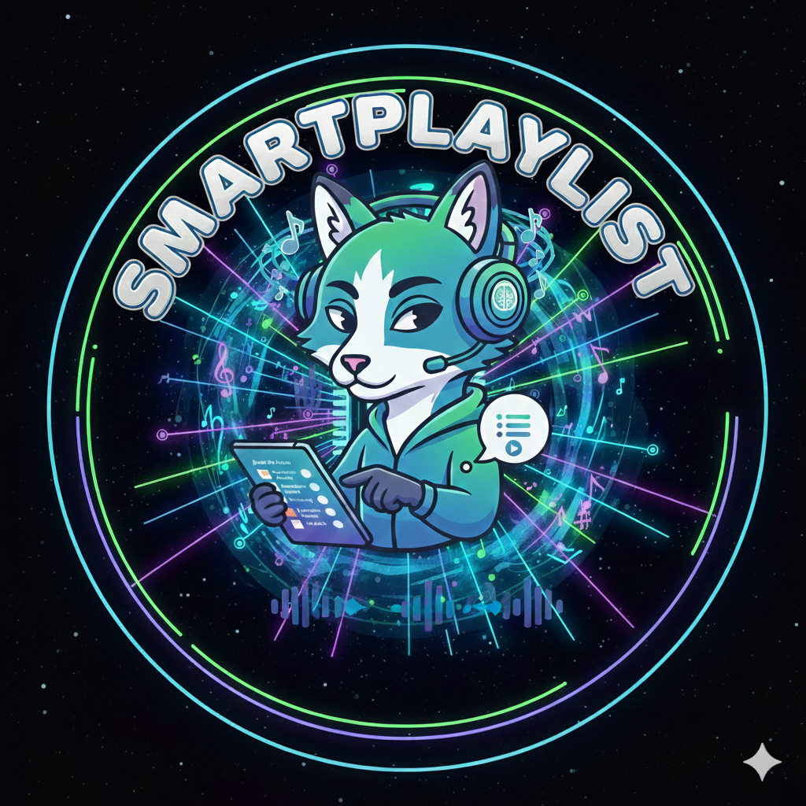

<div align="center">
  <h1>Smartplaylist</h1>
  
</div>

<p align="center">
    <strong>Smartplaylist lets you interact with your music library as you would with a person, creating complex playlists from your music collection by simply describing what you want to hear.</strong>
</p>

<p align="center">
    <a href="https://www.python.org/downloads/"></a>
    <a href="https://github.com/jjmartres/smartplaylist/actions/workflows/release.yml"></a>
    <a href="https://codecov.io/gh/jjmartres/smartplaylist"></a>
    </br>
    <a href="https://modelcontextprotocol.io"></a>
    <a href="https://modelcontextprotocol.io/specification/latest"></a>
    <a href="https://docs.astral.sh/uv/"></a>
    </br>
    <a href="https://github.com/jjmartres/smartplaylist/issues"></a>
    <a href="https://github.com/jjmartres/smartplaylist/pulls"></a>
</p>

---

## Key Features

- **Conversational Playlist Creation**: Use natural language to create playlists. The MCP server understands your requests and intelligently builds playlists based on your descriptions.
- **Programmatic Library Access (MCP Server)**: The MCP server provides a powerful API to interact with your music library. Get statistics, list genres and playlists, create new playlists, and perform advanced searches.
- **Simple CLI Management**: A Typer-based CLI makes it easy to set up and maintain your music library. The `sync` command intelligently initializes a new beets library or updates an existing one.
- **Developer Library**: The core `beets-wrapper` library offers a clean, Pythonic API for developers to build custom integrations and tools on top of the beets ecosystem.

## Architecture Overview

Smartplaylist is designed with a layered architecture to separate concerns and maximize flexibility:

1.  **Core Library (`beets-wrapper`)**: At the lowest level, the `beets-wrapper` library provides a high-level, object-oriented interface to the beets music database. It abstracts away the complexities of the beets internal API, offering a simple and powerful way to interact with your music library programmatically.
2.  **Interfaces**: On top of the core library, two main interfaces provide user-facing functionality:
    - **CLI (`typer`)**: A command-line interface for essential library management tasks like synchronizing your library.
    - **MCP Server (`mcp`)**: A server that exposes the full power of the core library through a web API. This enables conversational playlist creation and other advanced programmatic interactions.

This layered approach allows developers to use the right tool for the job, whether it's managing the library from the command line, building a custom application with the `beets-wrapper`, or integrating with other services through the MCP server.

## Technology Stack

- **Python 3.11+**
- **mcp**: For the MCP server.
- **Typer**: For the command-line interface.
- **Pydantic & Pydantic-Settings**: For data validation and settings management.
- **uv**: For dependency management and running the project.
- **pytest**: For testing.
- **ruff**: For linting and formatting.
- **beets**: As the underlying music library manager.

## Getting Started

### Installation

#### From source

To get started, clone the repository and install the project using `uv`:

```bash
git clone https://github.com/jjmartres/smartplaylist.git
cd smartplaylist
make setup
```

#### As a CLI tool

You can also install the `smartplaylist` CLI tool directly using `uv`:

```bash
uv tool install git+https://github.com/jjmartres/smartplaylist.git
```

### Usage

#### Command-Line Interface (CLI)

The CLI helps you manage your beets library configuration.

**Initialize or update your music library:**

```bash
smartplaylist sync /path/to/my/music
```

This command will create a `config.yaml` and a `smartplaylist.db` database file on the first run, and update the database on subsequent runs.

For a more detailed guide, see the [**Quickstart Guide**](./docs/user-guide/QUICKSTART.md).

#### MCP Server

The MCP server gives you programmatic access to your music library through a simple API.

**Start the server:**

```bash
smartplaylist serve
```

By default, the server will run on `http://127.0.0.1:8000`.

> For a detailed reference of all available tools, see the **[MCP Server API Guide](./docs/user-guide/MCP_SERVER_API.md)**.

For more information on development, check out the [**Developer Guide**](./docs/developer/DEVELOPER-GUIDE.md).

#### Running with Docker

The easiest way to run `smartplaylist` is with Docker.

**Build the image:**

```bash
docker build -t smartplaylist:latest .
```

**Run the container:**

A `make docker-run` command is available to streamline this process. It will stop and remove any existing `smartplaylist` containers, rebuild the image, and run it in detached mode.

```bash
make docker-run
```

Alternatively, you can run the container manually:

```bash
docker run -d --name smartplaylist -p 8000:8000 \
  -v /path/to/your/music:/app/data \
  smartplaylist:latest
```

This will start the container in the background, sync your music library, and start the MCP server on port 8000.

#### Running with Docker Compose

A `docker-compose.yml` file is also provided for a more streamlined experience.

1.  **Edit `docker-compose.yml`**: Change the volume mapping to point to your music library:

    ```yaml
    volumes:
      - /path/to/your/music:/app/data
    ```

2.  **Run Docker Compose**:

    ```bash
    docker-compose up -d --build
    ```

     This will build the image, create a container, and start the `smartplaylist` server.

     You can also set environment variables in this file to configure path rewriting for playlists:

     ```yaml
     environment:
       - SMARTPLAYLIST_MUSIC_LIBRARY_PATH_FROM=/path/on/host
       - SMARTPLAYLIST_MUSIC_LIBRARY_PATH_TO=/path/on/player
     ```


## Contributing

Contributions are welcome! Please see our [**Contributing Guide**](./CONTRIBUTING.md) for more details.

## Support

For help with bugs, feature requests, or questions, please see our [**Support Guide**](./docs/SUPPORT.md).

## License

This project is licensed under the MIT License. See the [LICENSE](LICENSE) file for details.
